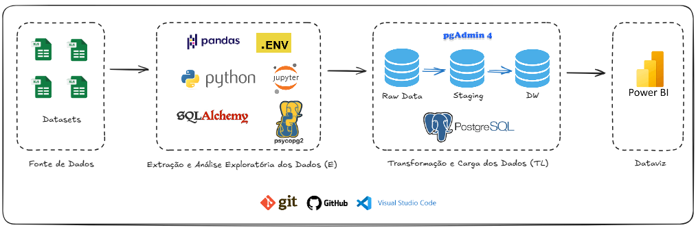

# Projeto Demonstração de Fluxo de Caixa (DFC)

## 🚀 Evolução da Arquitetura do Projeto: ETL com Python & SQL | Dataviz com Power BI
Este documento detalha a evolução da arquitetura do projeto de Demonstração de Fluxo de Caixa (DFC), que migrou de uma abordagem de ETL (Extract, Transform, Load) simples e atrelada ao Power BI para uma solução robusta baseada em um Data Warehouse (DW) com Python e PostgreSQL.  

[Clique aqui para ver Artigo no LinkedIn referente ao projeto na versão 1.0.](https://www.linkedin.com/posts/renato-malbuquerque_data-dados-dataabranalytics-activity-7385885975723446272-s__Q?utm_source=share&utm_medium=member_desktop&rcm=ACoAAASmTtwBGZ_oPJdVVzH2BmXOpsUhvTZfQPE)  

[Clique aqui para ver Projeto original no GitHub, versão 1.0.](https://github.com/renato-albuquerque/projeto_fluxo_de_caixa_evolve)

## Arquitetura do Projeto

### Arquitetura do Projeto | Versão 1.0

### Arquitetura do Projeto | Versão 2.0

## 🎯 Da Versão 1.0 à Versão 2.0 (Comparativo entre Arquiteturas)
A transição de arquitetura visa aumentar a confiabilidade, a escalabilidade e a performance desta solução de BI.  

| Característica | Projeto 1.0 (Inicial) | Projeto 2.0 (Otimizado) |
| :--- | :--- | :--- |
| **Arquitetura** | Power BI como ETL (Power Query) | Pipeline Python + PostgreSQL DW |
| **Fluxo de Dados** | Excel ➡️ Power BI (Memória/Modelo) | Excel ➡️ Python ➡️ PostgreSQL ➡️ Power BI |
| **Processamento (T)** | Transformação dependente do Power Query | Exploração e Limpeza em Python |
| **Armazenamento** | Modelo de Dados do Power BI | PostgreSQL (Raw, Staging, DW) |
| **Principal Benefício** | Rapidez de desenvolvimento | Confiabilidade e Desempenho em Escala |

## ✨ Benefícios da Nova Arquitetura (Projeto 2.0)
A introdução do Python e do PostgreSQL, estruturados em um *Data Warehouse* (DW) com múltiplas camadas, estabeleceu uma base sólida de **Business Intelligence (BI)** para a análise de Fluxo de Caixa.

### 1. Confiabilidade e Qualidade de Dados (Data Governance)
* **Imutabilidade (Camada Raw):** Os dados brutos originais são preservados, permitindo auditoria e reversão de transformações.
* **Transformação em Python:** Utilização de scripts Python para regras de negócio mais complexas, transparentes e versionáveis, garantindo que a limpeza e padronização sejam aplicadas de forma consistente.
* **Camada Staging:** Ambiente dedicado para validação de qualidade e saneamento dos dados antes da carga final.

### 2. Performance e Escalabilidade do Power BI
* **Desacoplamento de Transformação:** O Power BI agora se conecta diretamente à **Camada DW** (PostgreSQL), recebendo dados já limpos e modelados. Isso descarrega o trabalho pesado do Power Query, otimizando o modelo de dados do Power BI.
* **Dashboards Mais Rápidos:** A conexão com o PostgreSQL, otimizada para consultas, garante que os relatórios e dashboards no Power BI sejam carregados e atualizados mais rapidamente, mesmo com o aumento do volume de dados.

### 3. Modelagem Dimensional e Consistência Analítica
* **Estrutura de Data Warehouse:** A modelagem dos dados em tabelas Fato (movimentações) e Dimensão (tempo, contas, etc.) dentro do PostgreSQL cria uma base analítica estruturada (Star Schema).
* **Fonte Única da Verdade:** O PostgreSQL se torna o repositório centralizado e oficial das métricas de Fluxo de Caixa, assegurando que todos os cálculos e relatórios (incluindo o Power BI) utilizem definições consistentes.  

Em resumo, a versão 2.0 transformou o projeto de uma análise simples em uma solução de dados robusta, garantindo que as decisões financeiras sejam baseadas em dados de **alta qualidade, performance e governança**.